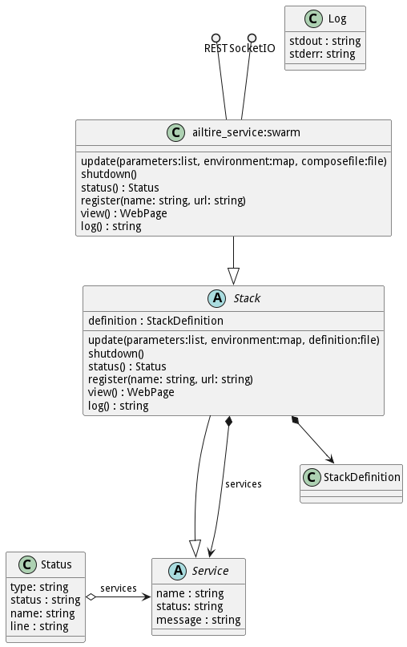

# ailtire_service swarm

## ailtire_service:swarm

ailtire_service:swarm is an implementation of the Stack class. The implementation uses docker swarm as the underlying
orchestration and deployment technology. It uses a sidecar design pattern to launch and manage a stack deployed in the 
system. This stack contains a micro-segmented network, storage, and services. 

## Stack
A Stack is an abstract class that defines the interface for the stack to be used to deploy, manage, and teardown the
stack. By convention a stack runs in its own micro-segmented network. All of the services in a stack run inside that
network. All access to the services in the stack goes through a firewalled gateway to the micro-segmented network. 
Because a Stack is a type of Service, there can be multiple layers of stacks and services in the deployment of a 
system. 

A Stack's interface is exposed through a RESTful interface. The following is the RESTful interface for the Stack class.
### update(parameters: List, environment: map, definition:file)

Update the stack that is currently running is a new stack definition, environment variables and parameters. The
Stack will be updated based on the deployment strategy in the current Stack Definition. The Stack Definition

### shutdown()

The shutdown method shuts down the stack and all of its services. If a service in the stack is a stack the shutdown REST interface is called.
The shutdown of the complete stack happens bottom-up not top-down. This prevents zombie services without a managing
stack at the top.

### status : Status

The status method returns the status of the complete stack and its services. In the case that a service is a type of
stack the status REST interface is called on that stack and returned to the parent stack. 

### register(name: string, url: string)

The register method is important in establishing a control plane between the stack and its children. When a child 
service that is a stack starts it registers with its parent stack. The child stack then monitors the services in its
stack and reports of any status or errors to the parent.

### view() :WebPage

The view method returns a webpage that gives a single page interface to the stack. This page can easily be injected
into existing management webpages.

### log() : string

The log method returns the logs for the stack and its services. This gives administrators and
developers the ability to debug services deployed in the system.

## Service

A Service is an abstract class that maps to a service in a container ecosystem. A Stack is a type of Service that
controls and manages other services. 

## Log

A Log is the stdout and stderr of a running Service.

## Status

A Status object consists of information about an individual service. It includes the type of service (Service or Stack),
status of the service, name of the service, and the last line from the message log. This can be used to build a 
management portal for the service.

#Implementation

Each Stack is implemented using the stack construct in docker swarm. Each docker stack has two or more networks. 
The parent network, the silbing network, and a child network for each service in the stack that is a stack type. 
Each child network of the stack becomes the "parent network" for that stack when it is created.
All of the services in the stack communicate on the sibling network. That traffic is segmented off of the parent 
network and any cooresponding child networks. This micro-segmentation protects the traffic and isolates the traffic 
from intrusion from other servics not in the stack. 

All communication outside of the sibling network is managed by a reverse proxy service for the stack or the 
cooresponding child network reverse proxies. In reality these are just stack instances themselves and follow
the same pattern.

Because services and stack can run anywhere in the architecture, accessing the services and stack is only through 
the controlling stack's reverse proxy. The top of the application tree contains a reverse proxy that maps the urls 
to the appropriate services and stacks.

Every stack including the top stack is deployed as a single docker container. The container must have access to the 
docker socket, have the appropriate environment variable set, and have access to the image repository. 
The ailtire app deploy command creates all of the neccessary environment variables and configurations.

