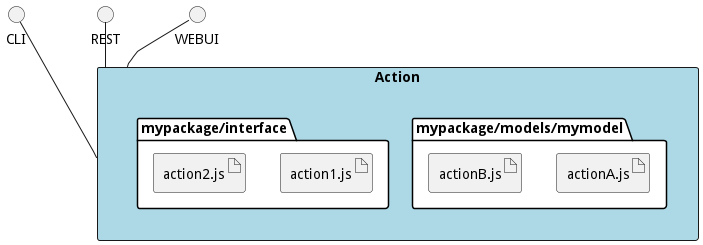

# Action

An Action is something that an actor can perform on the system. It is implemneted such that an actor can interface
with a CLI, REST or Web Interface.

## Command Line Interface


```shell
# Create a interface action for MyPackage
ailtire action create --name "actionname" --package "MyPackage"
# Generates api/MyPackage/interface/actioname.js

# Create a method action for MyClass
ailtire action create --name "actionname" --model "MyClass"
# Generates api/MyPackage/models/MyClass/actioname.js
```

## Generated Artifacts

Actions are implemented with a single javascript file. A REST, CLI, and Web Interface is automatically accessible
by defining the action. Actions can be stored in the interface directory of the package or in the directory of
the model of a package.




All actions are created following the template below.
```javascript
module.exports = {
    friendlyName: 'actionname',
    description: 'Description of the action'
    static: false, // True is for Class methods. False is for object based.
    inputs: { // These are the parameters of the action.
        param1: {
            description: 'Parameter 1 of the action.
            type: 'object', // string|boolean|number|json|object
            required: true
        },
    },

    fn: function (obj, inputs, env) { // Function to run when the action is called.
        // Obj contains the object that the action is called for.
        // Or the class if the action is static.
        // Inputs contains a map of all of the inputs of action.
        // env contains the environmen that the action was performed.
        return obj;
    }
};
```

## Action definition

### friendlyName 

Name that action is called. All action can be called through different ways.

### Description

Description of the action. This is used in the documentation generation of the architecture.

### static

Static is true if this is a class method for model actions. Always static for package interface actions.

### inputs

These are the parameters of the action. The inputs attribute is a map that maps the parameters by name.
Each input has the following attributes:

* description - description of the parameter. USed for documentaiton and command line help command.
* type - This is the type of parameter ( string, boolean, number, json, or object).
* required - true or false. Throw an except if required parameter is not submitted.

### fn

This if the function that will be called when the action is fired. The function has three paramters.
* obj - Object of the function if static is false and the action is for a model.
* inputs - Contains a map of the inputs passed into the action.
* env - Contains the calling environment of the action. If REST contains env.req and env.res variables.

## Calling the Action
The action can be called using several different techniques. 
* javascript
* CLI - command line interface
* REST  - REST interface
* Web UI - Web User Interface

### Package Interface (Action)
This shows how actions for a package are accessed in javascript, cli, rest and web interface.

#### javascript 
The package interface can be called within a javascript.
```javascript
let results = AService.call('mypackage.actionname', {param1: 'name1'}, {param2: 'name2')};
```
#### Command Line Interface (CLI)
The package interface can be called with the command line interface. 
```shell
# Name of the paplication is myapp
myapp mypackage actionanem --param1 name1 --param2 name2
```

#### REST
The package interface can be called with the REST inteface.
```shell
# Name of the paplication is myapp
curl "http://localhost:8080/mypackage/actionname?param1=name1&param2=name2"
```

#### Web Interface
Look at the left panel for in the web interface under the packages items.

### Model Action 
Each Model has standard actions that are automatically generated.
* create
* list
* show
* update

This shows how actions for a model are accessed in javascript, cli, rest and web interface.

#### javascript
The model action can be called within a javascript. Both static and object are shown.
```javascript
let obj = MyModel.create({name:'myModel'}); // Static method.
obj.myaction({param1: name1, param2: name2}); // Object Method.

```
#### Command Line Interface (CLI)
The model action can be called with the command line interface.
```shell
myapp mymodel create --name myName # Static call
myapp mymodel actionanem --id obj_id --param1 name1 --param2 name2 # Object call
```

#### REST
The model action can be called with the REST inteface.
```shell
# Static Call
curl "http://localhost:8080/mymodel/create?name=myname"

# Object Call
curl "http://localhost:8080/mymodel/actioname?param1=name1&param2=name2"
```

#### Web Interface
Look at the right panel for in the web interface under the packages items.
