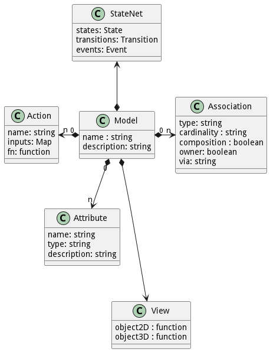

# Model

The Model is common known as a class or a data model element. All information in the architecture is stored in the
model. Models are tied to packages. The creation of models can be accomplished by the command line.

## Command Line Interface

```shell
# Create a interface action for MyPackage
ailtire model create --name "MyModel" --package "MyPackage"
# Generates api/MyPackage/models/MyModel/index.js

```

## Generated Artifacts

Actions are implemented with a single javascript file. A REST, CLI, and Web Interface is automatically accessible by
defining the action. Actions can be stored in the interface directory of the package or in the directory of the model of
a package.



The model definition has all of the information needed for the documentaiton and simulation of the model in the
architecture. The following is a template for a standard model.

```javascript

class MyModel {
    static definition = {
        name: 'Device',
        description: 'Representation of a device in a datacenter',
        attributes: {...},
        associations: {...},
        statenet: {...},
        view: {...},
    }
}

module.exports = Device;
```

All models are created in a models directory under the package directory. For example if the model is created under the
MyPackage package. The following would be generated.

```shell
api/MyPackage/models/MyModel/index.js
api/MyPackage/models/MyModel/method1.js
```

## Methods

Methods are implemented using actions. [Actions](action) are implemented with a javascript that is created in the Model
directory.

```shell
api/MyPackage/models/MyModel/index.js
api/MyPackage/models/MyModel/method1.js
api/MyPackage/models/MyModel/method2.js
api/MyPackage/models/MyModel/method3.js
api/MyPackage/models/MyModel/method4.js
```

Note that methods are implemented using actions as stored in the same directory of the index.js definition file for the
Model. In the above example there are four actions named method1, method2, method3, method4.

## Attributes

The attributes of a model are defined with a simple javascript map. The attribute can have one of many types available.
Types include: string, number, boolean and json.

```javascript
...
attributes: {
    name1: {
        type: 'string', // string | number | boolean | json
            description
    :
        'Name of the device'
    }
,
    name2: {
        type: 'string'
        description: 'Description of the attribute'
    }
}
,
...
```

## Associations

Associations can be used to relate models with other models in the architecture. Associations can be defined as the
following.

```javascript
...
associations: {
    assoc1: {
        type: 'OtherModel',
            description
    :
        'Description of the association',
            cardinality
    :
        1,
            composition
    :
        true,
    }
,
    assoc2: {
        type: 'OtherModel',
            description
    :
        'Description of the association',
            cardinality
    :
        'n',
            composition
    :
        false,
            owner
    :
        true,
            via
    :
        'device'
    }
,
}
...
```

Each association can be defined with specific attributes:

* type - This is the name of another model that is associated with the association.
* description - Description of the assoication used for docuemtnation generation.
* cardinality - 1 or 'n' - shows the number of instances of the association in the model.
* composition - Used if the associated model is part of the containing model. Used to give hints to storage mechanisms
  of the model.
* owner - Used to show ownership of the associated model. If the owning model is destroyed then all models associated
  with the owner flag set will be destroyed.
* via - Used to automatically create back links from the associated model to the owning model.

## StateNet

The StateNet allows you to define how a model moves through different states and transitions based on the definition in
the model index.js file. The following is a simple example of a StateNet for a model.

```javascript
...
statenet: {
    Init: {
        description: "This is the default initial state of an instances of the model",
            events:
            {
            create: {
                Enabled: {
                }
            },
            reserve: {
                Enabled: {
                }
            }
        }
    },
    Enabled: {
        description: "This state says that the model instance is enabled and can be used."
        events: {
            disable: {
                Disabled: {
                }
            }
        }
    },
    Disabled: {
        description: "This state says the model instance cannot be used."
        events: {
            enable: {
                Enabled: {
                }
            }
        }
    }
```

In this example there are three states in the statenet:

* Init - This is the initial state and when reserve or create actions are called it moves to the Enabled State.
* Enabled - This state can be transistioned from with a call to the disable method which will then move the state to
  disabled.
* Disabled - This state can be transistioned to the enabled state when enable is called.

This simple statenet automatically checks for state net transitions and throws exceptions if the statenet is violated.

StateNets can be defined with additional parameters. It follows the following template.

```javascript
statenet: {
    StateName: {
        description: "My Description of the state",
        events:
        {
            eventName: { // This can be an event or an action that is called on the object instance.
                StateName: { // State to transition to when the eventName occurs.
                    // Should return a boolean. If true then the transistion to this state is made.
                    condition: function (obj) { ... },
                    // These actions are executed when the transition happpens. 
                    action: function (obj) { ... },
                }
            },
            eventName2: ...,
        }
        actions: {
          // Actions called when entering the state.
            entry: {
                entry1: function (obj) { ...
                }
                entry2: ...
            },
           // Action called when exiting the state.
            exit: {
                exit1: function (obj) { ...
                },
                exit2: ...
            }
        }
    }
}
```

This state net definition allows architects to define simple statenets with basic transistions, all the way to complex
statents that include conditional transitions, actions for transitions and entry and exit actions for each state.

## View

This gives architects the ability visualize an instance of the model in a 3D graph or a 2D graph.
The 2D 

```javascript
    view: {
      color: "#cccccc", // Color of the object instance.
        // 2D object instance representation.
        // This should return a <svg> representation of the object instance.
      object2d: (options) => { 
          // Triangle
          let material = { color: "#cccccc", border:"#000000"};
          if(options) {
             material = options;
          }
          return `<polygon points="-10,10 10,10 0,-10 -10,10" style="fill:${material.color};stroke:${material.border};stroke-width:1" />`;
      },
      // 3D object instance representation.
      // This should return an <Aframe> representation of the object instance.
      object3d: (options) => {
          let materials = {
              '': `color:#cccccc; transparent:true, opacity:0.90;`,
              'Selected': `color:#ffff00; transparent:true, opacity:0.90;`,
              'Targeted': `color:#00ff00; transparent:true, opacity:0.90;`,
              'Sourced': `color:#ff0000; transparent:true, opacity:0.90;`
          };
          let retval = "";
          for(let i in materials) {
              retval += `<a-entity id="Device3D${i}">` +
                  `<a-cone radius-bottom="10" height="20" radialSegments="10" position="0 0 0" material="${materials[i]}" ></a-cone>` +
                  `</a-entity>`;
          }
          return retval;
      }
  }
```

The view of the object instance helps visualize complex 2d and 3d graphs of the system simulation.

### 2D Object Instances
For 2D object visualization SVG is used to define the object instance. For more information
on SVG see this [SVG Tutorial](https://www.w3schools.com/graphics/svg_intro.asp).

### 3D Object Instances
For 3D object visualization AFrame is used to describe the object instance.
AFrame lets you design 3D objects using something similar to HTML. For
more information see the [AFrame Quick Start Guide](https://aframe.io/docs/1.1.0/introduction/).

3D Objects use color to show that a object is selected in the graph.
There are 4 different colors that are used 
* Selected - Yellow
* Targeted - Green
* Sourced - Red
A 3D object instance is created for each state of the object instance in the graph view.


