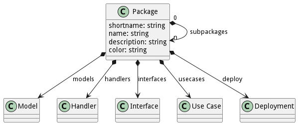

# Package

Package is the main architectural element in the architect. A Package can contain sub packages, models, usecases,
interfaces, and deployment strategies.

## Command Line Interface

```shell
# Create a Package name My Package
ailtire package create --name "My Package"

# Create a subPackage of My Package namde Sub Package
ailtire package create --name "My Package/Sub Package"
```

For more information about the command line interface see [ailtire package](cli-package).

## Generated Artifacts

I directory structure is created for each package. Any Package can have sub-packages to n levels in depth. The directory
structure contains everything needed to define the package. The following directory structure contains a package with 2
sub packages

```shell
api/MyPackage # Base Directory of the MyPackage package.
api/MyPackage/index.js  # Definition file for MyPackage package.
api/MyPackage/deploy # Deployment strategy for the MyPackage package.
api/MyPackage/doc # Additional Documentation for the package. This is where you can put extra docs in.
api/MyPackage/handlers # Event handlers for the package. Actions are performed when events are triggered.
api/MyPackage/interface # Exposed Interface for the package. All access to the package assets should be through the interface.
api/MyPackage/models # Directory containing model definitions.
api/MyPackage/usecases # Directory containing usecase definitions.
api/MyPackage/SubPackage1 # Root Directory of the SubPackage1 package. It will contain the same directory structure
api/MyPackage/SubPackage2 # Root Directory of the SubPackage1 package. It will contain the same directory structure
```



### Package Definition

Each package has an index.js file in the Package Root directory. This file follows the following template.

```javascript
// api/MyPackage/index.js
module.exports = {
    shortname: 'mp', // Short noame for the package. Typically the capiltal letters of the name.
    name: 'My Package',
    description: 'Description of the package...'
    color: 'pink' // Used documentaiton and simulation to help identify it with color. Names or rgb values can be used.
};
```

### Deployment

This contains the deployment strategy for the package. Every Package has a deploy directory and a default deployment
strategy. The following is the default deployment strategy.
```shell
api/MyPackage/deploy/gateway # gateway micro-service
api/MyPackage/deploy/web # web micro-service
api/MyPackage/deploy/build.js # build definition for each micro-service
api/MyPackage/deploy/deploy.js # deployment for each environment in  your system.
api/MyPackage/deploy/docker-compose.js # docker compose file for the microservices and network definitions.
```
The key to the deployment strategy is that you define all of you micro-services, network configurations, and environments
for the deployment of the micro-services.
For detailed information on how the deployment strategy works see [Deployment Page](deployment).

### Documentation

This contains the additional documentation for the package. See the [Documentation Page](documentation) for more
information. The documentation is stored in the "doc" directory.

### Handlers

### Interface
The interface directory contains files for each interface of the package. The interface can be accessed via the CLI,
REST, or Web UI. The interface directory can contain files that for each interface or a directory of files for each
interface. All of the files use [actions](action) to define the interface. See the [Action Page](action) for more 
information. 

It is important to understand how to access the interface of the package. Given the following directory structure:
```shell
api/MyPackage/interface/inter1.js
api/MyPackage/interface/inter2.js
api/MyPackage/interface/foobar/interA.js
api/MyPackage/interface/barfoo/interB.js
```
Four interface points exist for the package.
* inter1
* inter2
* foobar/interA
* barfoo/interB

#### CLI Access

To access this interface with the Command Line Interface you would type in the following on the command line.

```shell
myapp mypackage inter1 --param1 name1 --param2 name2
myapp mypackage inter2
myapp mypackage foobar interA
myapp mypackage barfoo interB
```

#### REST Access

To access this interface with the REST interface you can access this via any language or via a browser.

```shell
curl "http://localhost:8080/mypackage/inter1?param1=name1&param2=name2"
curl "http://localhost:8080/mypackage/inter2"
curl "http://localhost:8080/mypackage/foobar/interA"
curl "http://localhost:8080/mypackage/barfoo/interB"
```

#### JavaScript Access

Interfaces to packages can be access in javascript as well. This can happen in action defintions in the system.
It is important to access actions via the interface because deployment models may be different in different
environments. Which may include packages being deployed on multiple processes. The underlying ailtire framework
handles the translation of interface calls to the best technique to call the interface.

```javascript
let result = AService('mypackage.inter1', {param1: name1, param2: name2});
let result = AService('mypackage.inter2');
let result = AService('mypackage.foobar.interA');
let result = AService('mypackage.barfoo.interB');
```


### Models

The "models" directory contains the data model for the package. Each model class will create a sub directory in the models directory.
See [Model Page](model) for more information.

### Sub Packages

When a sub package is create a directory with the name of the subpackage is in the parent package root directory.
For example, a sub package with the name "My Sub Package" will create a directory "MySubPackage". When the sub
package is created the same package directory structure is created.

