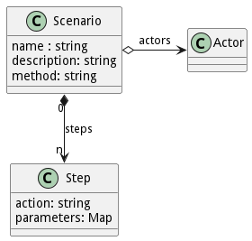

# Scenario

Scenario is an instance of a use case from the perspective of an actor.

## Command Line Interface

```shell
# Create a scenario for a use case.
ailtire scenario create --name "Scenario Name" --usecase "Use Case Name"

# Launch the simulation for a scenario.
ailtire scenario launch --id "UseCaseName.ScenarioName"
```

For more information about the command line interface see [ailtire scenario](cli-scenario).

## Generated Artifacts

One file is generated when a scenario is created. The file describes the scenario and the steps that are taken to
realize the scenario. The file generated is created in the UseCase directory and has the name of the scenario and the
file extension .js.

```javascript
// filename: api/MyPackage/usecases/MyUseCase/MyScenario.js
module.exports = {
    name: 'My Scenario",
    description: 'Description of the Scenario',
    method: 'datacenter/list', .// Action called to view the results of the scenario.
    // Actors that can call the scenario. This can be used for AAA secuirty of the system.
    actors: {
        'IT Operations': 'uses',
    },
    // Steps to perform to realize the scenario.
    steps: [
        {action: 'device/create', parameters: {name: 'host1', file: './templates/device.yaml'}},
        {action: 'device/create', parameters: {name: 'host2', file: './templates/device.yaml'}},
    ]
};
```


When a scenario is "launched" with the [scenario launch command](cli-scenario-launch). The command line interface of the
application is used to run the steps in the scenario. The working directory for the simulation launch of the system is
the root directory of the application. Any references to files should be relative to the root directory.


