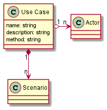

# UseCase

The Use Case is how an [Actor](actor) interacts with the system architected.

## Command Line Interface

```shell
ailtire usecase create --name "Use Case Name" --package "My Package"
```
## Generated Artifacts

When a usecase is created it will generate the following directory structure.


```shell
api/MyPackage/usecases/USeCaseName # root directory of the UseCase
api/MyPackage/usecases/USeCaseName/doc # Documentation directory of the Use Case.
api/MyPackage/usecases/USeCaseName/index.js # Definition of the UseCase
api/MyPackage/usecases/USeCaseName/scenarioname.js # Created for each scenario created.
```

The definition of the UseCase is in the index.js file in the root directory of the use case.

````javascript
module.exports = {
    name: 'Use Case Name',
    description: 'Description of the Use Case',
    method: 'device/list', // method to call for the use case.
    // Actors of the use case.
    actors: { 
        'My Actor': 'uses',
    },
};
````
