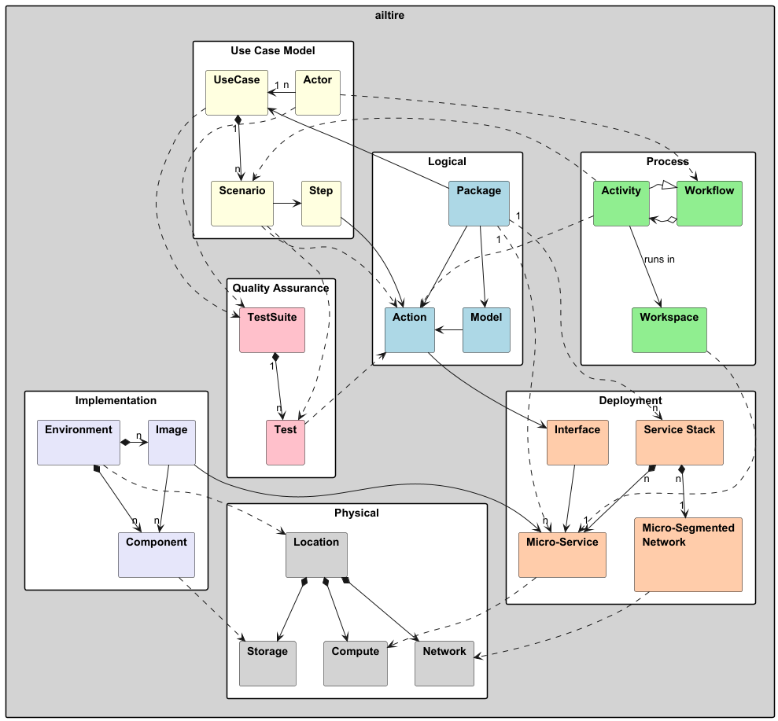

# Architectural Overview

* Logical
    * [Action](action) - actions for packages in the interface directory and models actions.
    * [Model](model) - models in the package models directory
    * [Package](package) - package/subsystem of the architecture.
* Process
    * [Micro-Segmented Network](deployment#network) - Network for a service stack including firewall rules etc...
    * [Micro-Service](deployment#microservice) - Individual service of a set of service stacks.
    * [Service Stack](deployment#stack) - The aggregation of micro-services and micro-segmented networks for a package and its
      sub-packages.
* Deployment
    * [Container](deployment#container) - Container that implements a micro-service for specific environment.
    * [Environment](deployment#environment) - Dev, Test, Production for the application. Custom enviornments may be used.
    * [Interface](package#interface) - Interface for the container. Including CLI, REST, and WebUI.
    * [Test](test) - Test cases for the application based on usecases and scenarios.
* Use Case Model
    * [Actor](actor) - A user of the application through the use cases.
    * [Scenario](scenario) - A sequence of steps for a specific use case.
    * [Step](scenario#step) - An individual call to a method with specific parameters.
    * [UseCase](usecase) - I use of the system by actors.
* [Implementation](directory)

## Logical

This is the logical view of the architecture. This includes typical information about the packages, classes, and data
model of the architecture. Documentation of the logical view can be found in the docs directory and is auto generated
based on the definition of [Packages](package) and [Classes](class). The Web User Interface also allows architects to
navigate the logical view of the architecture.

## Process

This view layouts out how the processes of the architecture interact with them. A micro-service pattern is used in the
architure which include the aggreation of [micro-services](microservice) and their [networks](network) into
[service stacks](stack).

## Deployment

Deploying the architect onto hardware follows a multi-hybird cloud architecture. Mapping of resources to micro-services
should be accomplished with service orchestration like K8s or Docker Swarm. The deployment model shows how the
[containers](deployment#container) are mapped to the [environment](deployment#environment). The Containers are accessed through 
[interfaces](interface).  See also the [Deployment Page](deployment) for more information.

## Use Case Model

Applications are used by Actors. An [Actor](actor) can be a person, another application, or another package. Actors use
the application or package through [use cases](usecase). Each [use case](usecase) has several [scenarios](scenario) 
that show different uses of the application.

## Implementation

The implmentation of the architecture shows the how the application is implemented in a directory structure.
See the [directory structure](directory) page for more information.
