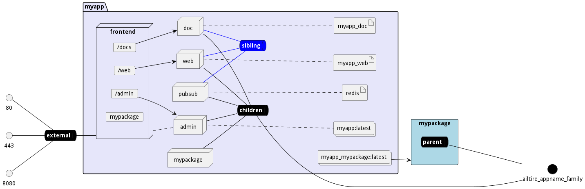

# Deployment

The deployment strategy for the application is defined in the deploy directory in the applications api directory and all
the package directories. The Ailtire Framework uses docker-compose file format to describe the design of the
deployment of the application. The actual deployment of the application can use k8s or docker swarm depending on your
configuration. Currently, The default engine to deploy and manage the application is docker swarm. Additional frameworks
and tools will be supported in the future.

## Directory layout

The application directory has a deployment strategy "./api/deploy" and each package has a deploy directory in its root
base dir. The following is the layout of the deploy structure.

```shell
deploy
   mservice1 - Microservice definition for mservice1
     Dockerfile - image definition for the microservice
     package.json - package file for the nodejs application
     server.js - entry point for the nodejs application implementing the microservice.
   mservice2 - Microservice definition for mservice1
     ...
   mservice3 - Microservice definition for mservice1
     ...
   build.js - Build script for containers
   deploy.js - Deployment defintion of the stack defined in the services.js or docker-compose.yaml file.
   services.js - Servies in the stack definition.
   docker-compose.yaml - Definition of the stack of micro-services, networks, and storage.
```
There are two ways a stack can be defined, a services.js file or a docker-compose.yaml file.
Stacks manage the services and networks in the stacks. In order to connect multiple stacks together specific environment
variables are passed down from the managing stack and children services and stacks. Examples of these stacks can be 
found in the docker-compose.yaml file. If using the services.js file there is no need to declare this environment 
variables.

### docker-compose.yaml

The docker-compose file format is used for the description of the stack for package. This includes sub packages as well.
The docker-compose file uses a common set of conventions to define the stack's substacks, services, and networks. In the
following example the applications deploy stack definition has 2 microservices and one substack.

* Application: myapp
* Top Package: MyPackage
* Micro Services: mservice1 mservice2

```yaml
version: "3.7"
services:
  mypackage:
    image: myapp-mypackage:latest
    stop_grace_period: 1m
    stop_signal: SIGINT
    volumes:
      - /var/run/docker.sock:/var/run/docker.sock
    deploy:
      replicas: 1
    environment:
      - AILTIRE_STACKNAME={{.Service.Name}}-{{.Task.Slot}}
      - AILTIRE_PARENT=${AILTIRE_STACKNAME}
      - AILTIRE_PARENTHOST=${AILTIRE_PARENTHOST}
      - AILTIRE_APPNAME=${AILTIRE_APPNAME}
    networks:
      - children
  mservice:
    image: myapp-mservice1:latest
    stop_grace_period: 1m
    stop_signal: SIGINT
    volumes:
      - /var/run/docker.sock:/var/run/docker.sock
    deploy:
      replicas: 1
    environment:
      - AILTIRE_STACKNAME={{.Service.Name}}-{{.Task.Slot}}
      - AILTIRE_PARENT=${AILTIRE_STACKNAME}
      - AILTIRE_PARENTHOST=${AILTIRE_PARENTHOST}
      - AILTIRE_APPNAME=${AILTIRE_APPNAME}
    networks:
      - children
  mservice2:
    image: myapp-mservice2:latest
    stop_grace_period: 1m
    stop_signal: SIGINT
    volumes:
      - /var/run/docker.sock:/var/run/docker.sock
    deploy:
      replicas: 1
    environment:
      - AILTIRE_STACKNAME={{.Service.Name}}-{{.Task.Slot}}
      - AILTIRE_PARENT=${AILTIRE_STACKNAME}
      - AILTIRE_PARENTHOST=${AILTIRE_PARENTHOST}
      - AILTIRE_APPNAME=${AILTIRE_APPNAME}
    networks:
      - children
networks:
  children:
    driver: overlay
    attachable: true
    name: ${AILTIRE_APPNAME}_myapp_family
  sibling:
    driver: overlay
```

In this file you can see there are two major sections. services and networks. This is the base for the stack. Any
additional docker-compose attributes can be added see
[Docker-compose file format](https://docs.docker.com/compose/compose-file/) for more information.

### services.js
A simplified mechanism to define the service architecture is to define the stack in the services.js file.
The following is an example of the services.js file
```javascript
module.exports = {
    services: {
        childStack: {
            type: "stack",
            image: "childStack",
            volumes: {
                docker: { source: "/var/run/docker.sock", target: "/var/run/docker.sock" }
            },
            interface: {
                "/cs": { path: '/', port: 3000, protocol:"http"},
                "/cs/socket.io": { path: '/socket.io', port: 3000, protocol:"http"},
            },
            policies: { },
            environment: { },
        },
        service1: {
            type: "stack",
            image: 'service1',
            volumes: {
                docker: { source: "/var/run/docker.sock", target: "/var/run/docker.sock" }
            },
            interface: {
                "/s1": { path: '/', port: 3000, protocol:"http"},
                "/s1/socket.io": { path: '/socket.io', port: 3000, protocol:"http"},
            },
            policies: { },
            environment: { },
        },
    },
    policies: {

    },
    interface: {
        ports: {
            80: 3000,
            443: 3000,
        }
    },
    data: {

    },
    networks: {

    }
}
```

### build.js

The build.js file contains the microservices build definitions. All microservices for the package are contained in 
the build.js file.

```javascript
module.exports = {
  app_pkg1_mservice1: {
    dir: '..',
    cmd: 'node mservice1/server.js',
    file: 'mservice1/Dockerfile',
    tag: 'app_pkg1_mservice1',
    env: {},
    packages: [
      "pkg1",
      "pkg2",
    ]
  },
  app_pkg1_mservice2: {
      ...
  },
  app_pkg1_mservice3: {
    ...
  },
}
```

The build file has several attributes for each build definition. These attributes help build the image container so 
it can be used as an individual microservice is in a service stack as defined in the deploy.js and services.js files.

* dir - This attribute is used to show where the working directory of the build begins. Basically the build script 
  will copy everything in the directory defined by the "dir" attribute into the root directory of required. This is 
  the directory used as the root for the docker build command called by the ailtire build subsystem. The path is 
  relative to the directory of the build.js file. If the "dir" attribute is not defined the current directory of the 
  build.js file is assumed.
* cmd - This is the command that will be run when the container is run. Again this assumes a base directory based on 
  the "dir" attribute.
* file - This is the name of the docker file. Again this is realiative to the directory defined in the dir  
  attribute. 
* tag - This is the tag to be used to tag the container image. If you are using a private repository or other 
  repositories please use the --repo commandline directive in the [ailtire app build](cli-app-build) or the [ailtire 
  package build](cli-package-build) commands. 
* env - This is a mapping that defines all of the environment variables for the build processes. If environment 
  variables need to be set for each build of the container this can be on the command line with the --env argument. 
  See the [ailtire app build](cli-app-build) or the [ailtire
  package build](cli-package-build) commands.
* packages - This attribute allows for multiple packages to be included in the microservice definition. This is 
  really handy when a microservice need models, interfaces, handlers, from more than one package to create all of 
  the services required for the microservice. This is an array with just a list of each package. The package is 
  copied directly into the microservice build directory so the microservice has everything needed to handle events, 
  expose a REST interface, and handle the business logic.


### MircoService definition

Each microservice has the name of the microservice and the image name is the fully qualified name of the microservice
from the build of the application see [ailtire app build](cli-app-build) command for additional 
information. There is additional information in the service like environment variables that are used to manage stacks of stacks and services.

#### Environment Variables

The environment variables all start with the prefix AILTIRE_.

* AILTIRE_PARENT - Parent stack name of the currently running stack. If this is the app stack this is will be empty
* AILTIRE_PARENTHOST - The Host that is running the Parent Stack. If this is the app stack this is empty.
* AILTIRE_APPNAME - The name of the application that is running this stack.
* AILTIRE_STACKNAME - The name of the stack currently running.
* AILTIRE_PARENT_NETWORK - The name of the parent network. Used for micro-segmentation meshes.

#### Build Definition
The build definition is responsible for building the container image for the microservice. Each package in the 
architecture defines its microservices in the deploy directory. Each deploy directory has a build.js file. The build 
file allows developers to create microservices based on directory contents, individual package definitions, and 
combinations of packages. See (build.js)[#build.js] for more information on the format of the build.js file.

#### Stack Definition (Application and Package)

Using the side-car pattern for containers, stacks are treated like a microservice themselves. In fact a single
container image is created for the whole application that basically can be scheduled as a service in a docker
swarm stack. This allows for systems to be integrated more easily. The same is true for each package and sub package
in the system architecture. 

Each package has its own deployment strategy which out of the box creates a stack
as defined by a docker-compose.yaml file. A container image with the docker-compose.yaml file and a very lightweight
application with a REST interface allows the stack to be deployed, killed and monitored just like another other
container in the system. Behind the covers it is actually managing several services in the docker swarm stack.
This enables complex architectures to be easily deployed in managed that might contain several hundred running containers.

This diagram shows the common services that are used in an application stack as well as the underlying package
stack mypackage.



You can see that we have a frontend service that acts as an api-gateway for access to the services in the stack.
Every call to the stack goes through the api-gateway and routed to appropriate service on the back end. The 
following services are used for an application stack.
* admin - This uses the "ailtire_service" service to manage the api-gateway and route http request to the appropriate 
  service in the stack.
* doc - This serves up the documentation for the application using jekyll.
* web - This is the entry point for the web interface for the application simulation and rapid prototype.
* pubsub - This is the pubsub bus for websocket communication and event driven interface. Redis is currently used.
* mypackage - This is the package that contains the business logic for the microservice.
```

## See Also
* [ailtire app build](cli-app-build)
* [ailtire app install](cli-app-install)
* [ailtire app uninstall](cli-app-uninstall)
* [ailtire app status](cli-app-status)
* [ailtire package buildEngine](cli-package-buildEngine)
* [ailtire package install](cli-package-install)
* [ailtire package uninstall](cli-package-uninstall)
* [Directory Structure](directory)
