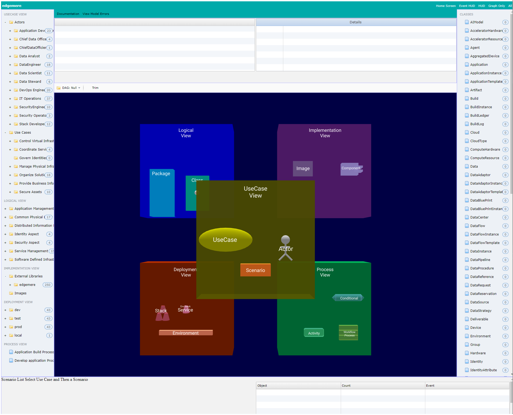

# Install Node

New to Node? No problem. In order to install Ailtire, you’ll first need to install Node.js. Node is supported on most
operating systems including Windows, MacOS, and Linux. There are plenty of pre-built installers for these platforms.
Goto the [nodejs website](https://nodejs.org/en/) and install nodejs and npm to start using ailtire.

# Install Ailtire

Installing ailtire is as easy as installing the ailtire npm package from the npmjs.org website. This is accomplished
using the npm command line. This will download ailtire and its dependencies. It normally takes about 30 seconds but
could take longer if you have a slow connection.

```shell
# Install ailtire pnm package globally.
npm install ailtire -g
```

# Creating your First Application

Now that you have install ailtire. You can use ailtire to create a new application. All you need to do is cd into the
directory you want to create your new application. Then type the ailtire command to create a new application.

```shell
# create the application using ailtire app create
ailtire app create --name myapp
> Application myapp2 has been created at ./myapp2.
> Type 'npm install' to populate dependencies.
> Then 'npm start' to start the application.

# Now type npm install to install of the project dependencies. 
# This can take some time. 1-2 minutes.
npm install

# Now you can start the web server for the application
npm start

> myapp@0.0.1 start C:\Users\dwpulsip\work\ailtire\myapp
> node index.js

Listening on port: 8080
```

Now you can go onto your favorite browser and start http://localhost:8080 to see your application's simulation screen.


# Architect Something Incredible

Your application is ready to be architected and designed. Using the ailrite command line interface is the easiest way to
create and modify architectural and design elements. Here are few starting pages to get started using ailtire:

* [Directory Structure](directory) - This shows the directory structure that is automatically created when the
  application is created.
* [Architectural Elements](architecture) - This page shows the key architectural elements in the ailtire model (UML).
* [Command Line Interface](cli) - This page shows the high level commands for ailtire to create packages, use
  cases, scenarios, and models.
* [Web Interface Basics](webinterface) - The default web interface shows you how to navigate the architecture visually
  and simulate usecases and scenarios in the architecture.
