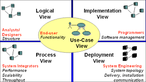

# ailtire

In the 1990s I started dabbling with a new kind of system analysis. Object-Oriented System Analysis. I quickly became
familiar with all the great OOA/D tools. The one that stood out for me was Rational Rose. I dove right in and over time
became quiet good at using the tool. I quickly started writing scripts to make my life easier and automate repeated
tasks. This was the birth of a project named bouquet. 

Move forward 20 years. I am still using UML to design and architect systems, but I also use rapid prototyping
technologies like sails, rails and grails. Most recently I am focusing on nodeJS development. I dusted off my old
bouquet specs and started working on resurrecting bouquet with the latest technologies. Following the same techniques 
of of UML. I looked aat building out the 4x1 architectural model.



In previous efforts in this space I generated code to fit different frameworks. With the availability of new techniques,
I changed my approach to use opinionated configurations and Proxy patterns to develop a meta-programming model using
nodejs to automatically the generated documentation, simulation of the architecture, and a rapid prototyping framework. This
allows system architects to focus on architecture instead of the details so many get bogged down in.

Instead of naming the new project bouquet 2.0. I decided to focs on a name that focused more on its true target
architecture. Ailtire was born. Aitire is Scottish Gaelic for architect.

These are the technologies that I am leveraging this time.

* PlantUML - Textual way of describing UML diagrams
* NodeJS - JavaScript libraries for backend services
* WebSocket - communication layer to communicate between micro-services
* Docker - containerization tools for microservices
* Commander - npm module for command line programming for NodeJS
* GitHub Pages - Markdown language for projects in GitHub.

The tools by themselves are very useful. Bringing all the tools together is where I found the most benefit.

## PlantUML

PlantUML is a component that lets you quickly write several UML diagrams using Text instead of a drawing tool. It is
great for many but not all of the UML diagrams. I have found that it covers everything that I typically need to do for
Architectures of systems. UseCase, Component, Class, Deployment, Scenarios, and Activity Diagrams.

One of the benefits of using PlantUML that the text files that your create (*.puml) can be checked in to GitHub. You can
also generate image files (png) from the text files (puml) and check in the image files as well. I do this so my design
documents in GitHub (Markdown language is used) can reference the images that have been generated. Generating the
image (png) files is as easy as typing in a command line.

```
# java -jar design/plantuml.jar myDiagram.puml
```

Because I am using NodeJS. I can use a npm script command to actually generate all of the my images. Basically I put
another target in my package.json file in the root directory that searches all of my design directories and generates
the png files.

```
  "scripts": {
  ...
  "design": "java -jar design/plantuml.jar design/*.puml design/**/*.puml",
  ...
  }
```

Now you can generate png or svg files for all of your design diagrams, just type.

```
# npm run-script design 
```

To find out more about PlantUML click [here](http://www.plantuml.com)
You can download the latest jar file for quick image generation [here](http://www.plantuml.com/downloads). There is also
a Plugin for PlantUML for [Intellij](http://getlink) and several other IDEs.

## Commander

Commander is a nodejs module for command-line processing. I use this to develop command line interfaces for the systems
that I architect. This gives me a quick and dirty way of providing a command line interface with very little lifting.

## GitHub Pages

I have chosen to use github MD - Markdown language for the documentation of projects. Although ailtire auto-generates
most of the documentation from the model elements. Additional documentation can be added by the architect by placing it
in corresponding doc directories. See [doc directory](directory-doc) for more information.

## ailtire

Using the concept of convention over configurability of frameworks like sailsjs, I extended the same concepts that
already exist in nodejs and created a directory hierarchy that sits in the project root directory. This gives me a place
to put the design of the architecture as well as the CLI (Command Line interface) of the system being architected. This
is important because most of the architectures I am working have a Web, REST and CLI .

### Command Line Interface 

For each application a script is created in the bin directory with the name of the application.
```shell
# for a application with the name "My App"
myapp <cmd> [args]
```
The command line interface is dynamically created based on the interface of each package and the models in the application.

1. Initialization script - "appname init"
1. Top Level Command script - "appname"
1. Package Command Script - "appname packagename interfacename"
1. Model Script - "appname mymodel method"

The goal here is that we have a consistent command line interface. For example in the project named caade the following
are some commands.

```shell
myapp init --host localhost:8080 # Initialize the application command line
myapp mypackage method --paramq "Parameter" # call the mpacakge interface method.
myapp mymodel create --name "Model Name" # create an instance of the model with the name "Model Name"
```

### REST Interface

The REST interface is derived from the package interface directory which contains the actions. Additional rest interface
methods are automatically generated for each model following the CRUD paradigm. Additionally each method of each model
can be accessed via a rest interface. The follow are some examples of REST interface.

```shell
# call the action method in the package mypackage with the parameter param1 with name1
curl "http://localhost:8080/mypackage/method?param1=name1"

# call the method create on the model mymodel with the parameter name with the value name1.
curl "http://localhost:8080/mymodel/create?name=name1"

```
See [interface](interface) for more information about package and application interfaces.

### Web UI Interface

The Web UI Interface is autogenerated from the definition of the model itself. 


* Left Panel - Actors, Packages, and UseCases
* Top Panel - Detail Information about the selected item in the web interface.
* Middle Panel - Graphical view of selected item. 3D view of the architecture or simulation.
* Bottom Left Panel - Launching scenario steps for simulation.
* Bottom Right Panel - View of all message events during the simulation
* Right Panel - List of all of the classes in the architecture.

This can be modified in the view directory. For more information see [Web Interface](webinterface) page.
