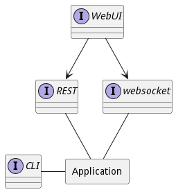

# Interface
The ailtire framework presents several different interfaces for the application and its components.
These interface can be accedessed programatically, with REST, websocket, and commandline interfaces, as well as
through a web interface. Interfaces are automatically accessible based on the architectural elements in the 
application.



## Mapping Interfaces
For every interface there is an action that performs work in the architecture. An action can be accessed through
one of the interface mechanisms in a standard and repeatable manner. This is important in large complex architectures.
Following a naming convention makes it much easier to access the interface without having to know or understand
every aspect of the application or its packages.

### Command Line Interface Mappings

The command line interface (CLI) allows users to access the application from the command line the same way they 
can access the application via REST, JavaScript, or any other interface. The key here is the API is consistent 
across the board.

Each action is mapped to it fully qualified name and parameters for the action, based on the name of the
application.

So for an action name "MyAction" that is part of a model name "MyModel". The following
is the format for calling the action.
```shell
# Calling a model method  with one parameter call.
myapp mymodel myaction --param1 name1

# Calling a model method with 2 parameters.
myapp mymodel myaction --param1 name1 --param2 name2
```

In the case of passing configuration files they are converted to
a json data structure and streamed to the REST api. In the following
example a template file is passed into the system.
```shell
myapp mymodel myaction --file ./template/config.json
myapp mymodel myaction --file ./template/config.yaml
```

Every command line interface calls the corresponding REST API for the action.
The command line handles all the communication and fault handling.
The only thing that a customer must do is initalize the application
on the machine running the commands. See [init](cli-app-init) for more information.
```shell
myapp init --host http://localhost:8080
```
This command will create a .ailtire.json file in the base directory
of the application.

### JavaScript
Many times you want to call a package interface from inside the application.
We suggest you actually call packages only through the package interface.
This helps you better define the architecture and looks for areas of reuse.
Another reason to call the interface is you want to now assume that one package
is running in the same process space as another package. Because each package
can be deployed as its own stack of services. There is no guarantee that packages
are deployed the same over the lifetime of the application.

Ailtire handles the decision of how to make the call to a package or model interface.
This happens at run time which gives flexibility in architecture that allows for scalability
and elasticity.

In the following example a package interface is called named "perform" in the sub package
named "SubPackage" in the Top Package named "MyPackage".

```javascript
let result = await AService.call('mypackage.subpackage.preform', parameters);

let result = await AService.call('mypackage.subpackage.preform', {param1: 'name1'});

// Shortend action paths work as well in the architecture.
let result = await AService.call('subpackage.preform', {param1: 'name1', param2: 'name2'});
```
Notice the "await" keyword. This turns the call into a synchronous call for the service call.
The AService.call handles await and Promise formats. This will help decrease the complexity of
using the API of the different packages.

For model method on objects or on static model methods. A fully qualified name is not needed
and you can call the method directly.

```javascript
// Calls the static MyModel.create method.
let myObj = new MyModel();
// Calls the object method name run.
myObj.run({param1: name, param2: name2}); 
// Calls the class method name generate
let mystuff = MyModel.generate({param1: name1});
```
Notice that the fully qualified name is not required. Just calling the model name and method name.

### REST Mappings 
The REST API of the application allows other applications and system integrators to
integrate withe the system independent of language and or location.
The REST API is dynamically and automatically available when the application or service
is deployed. Ailtire normalizes the REST api for package interfaces and model methods.
This is the same for all of the interfaces.
```shell
# This calls the "perform" interface for mypackage with 2 arguments
curl "http://localhost:8080/myapp/mypackage/perform?param1=name1&param2=name2"

# This calls the "perform" interface for mypackage with no arguments
curl "http://localhost:8080/myapp/mypackage/perform"

# This calls the model method create
curl "http://localhost:8080/mymodel/create?name=myname"

# This calls the object model method run. Note the id key.
curl "http://localhost:8080/mymodel/run?id=objid&param1=name1"

```
All results are returned in a json format.

### WebUI
The Web User Interface is designed to give architects the ability to simulate the design and architecture of 
the application. Additionally, the framework allows architects the ability to rapid prototype web interfaces 
using a MVC paradigm. It is easy to extend existing views of the architecture in the views directory of the
directory structure.

For more information see the [Web Interface Page](webinterface).

### Websocket

Websocket is a full-duplex communication channel over a single TCP connection. The ailtire framework uses
socket.io to provide the websocket protocol. The architecture uses this to provide an event driven paradigm.
The definition of event management is defined for packages and models. This allows for the architecture to
be reactive and event driven.

#### Package Handlers
Package event handlers are defined in the "handlers" directory. Each event trigger handled by the package has
its own file "<event>.js". In the following example the event "MyModel.create" is handled by the Package named
"MyPackage".
```shell
./api/MyPackage/handlers/mymodel.create.js
```
Each event handled by the package will have its own file. If multiple actions are performed for an event handle
it is specified in the <eventname>.js file. The following is an example of multiple actions for the same event
handler.
```javascript
module.exports = {
    // Name of the event being handled
    name: 'MyModel.create',
    handlers: [
        {
            description: 'Default Handler',
            // Function called when the event is fired. 
            // The data parameter contains the object that caused the event to fire.
            fn: function (data) { 
                console.log("Made it here: Request Needed!");
            },
        },
        {
            description: 'Handler with an action call',
            // Action to call when the event is triggered. 
            // The return value of fn function is passed as the input to the action.
            action: '/mypackage/store',
            // Any translation from the firing event to the action should be done in this function.
            fn: (data) => {
                return {object: data.obj};
            }
        },

    ]
};
```

In the first handler calls the function "fn" with the object reference of the object firing the event. 
The second handler is used to call an action. Because the event only carries information about the firing object,
it does not match up with the parameters of the action being called. For this purpose a function defined by "fn"
is run before the action is called. The purpose of this pre-processing function "fn" is to format the data in
a format that the action can understand.

#### Model Handlers

Model handlers are defined in the statenet of the model themselves. Handlers are activated depending on the current
state of the model instance. The handlers are triggered only when the event is fired.

For more information about model handler definitions look at more information in the StateNet section of the
[Model Definition Page](model).

## Default Interfaces

Interfaces are automatically created for models in the system. These default interfaces are implemented using
actions that apply to every model created in the architecture. These default actions can be overwritten by create
an action "<actionname>.js" with the same name in the model's base directory.

* add* - Add items to an object instance based on the association name.
* create - Create and object instance with the Model Class.
* destroy - Destroy the object instance.
* list - List all of the object instances of a specific Model Class.
* new - Used by the web interface to create a form used to create new object instances.
* show - Show the details of an object instance of a sepcific Model Class.
* update - Update the attributes of an object instance.

### add* interface

This gives the ability to add items to any association defined in the model definition. If a model has an association
named "other" then the interface can be called using the command line interface as such:
```shell
# This will add the other objects other1 and two to the other association
myapp mymodel addother --name "ObjectName" --items "other1,other2"

# This will add a newly created object defined in the parameter file passed in.
myapp mymodel addother --name "ObjectName" --file ./template/otherObjects.json

```

The parameters for the add action are as follows.

* name - name of the object to perform the add action to.
* items - a comma separated list of object names of the the associated type.
* file - a definition file of new objects of the association type to be created and added to the association.

Note this action can be overwritten to perform additional relationship constraints.

### create interface
This action creates an object instance of the model. By default only the name of the object is required.
The following is an example of creating an object instance with the command line interface.
```shell
# This will create an object instance of MyModel type.
myapp mymodel create --name "obj1"

# This will create an object instance based on the definition in the .json file.
myapp mymodel create --name "obj1" --file ./template/mymode.json
```
The parameters for the create action are as follows.
* name - name of the object instance
* file - object definition with information about the attributes and associations of the model.

Note this action is normally overridden in the definition of the model. A create.js action is called after the
object instance is created. The create action should populate the attributes and associations.

### destroy interface
This action destroys the object instance with the name specified in the parameter.

```shell
myapp mymodel destroy --name "obj1"
```
The parameters for the destroy action are as follows:
* name - name of the object instance to destroy.

### list interface
This action lists all of the object instances in the Model Class.
```shell 
myapp mymodel list
```
This action has no parameters.

### new interface
This action is used to create a form in the web interface with empty or default values for a web interface
form. This is primarily called from a REST interface from the web interface browser.

### show interface
This action returns a json object of all the attributes of the object instance.
```shell 
myapp mymodel show --name "obj1"
```
This action can be overriden if you need to show complex relationships with associations. The default show 
actions shows just the attributes and the high level associations.

### update interface
This action updates the object instance based on the model class.
```shell
# Update the object instance  with the  valueds defined in the file.
myapp mymodel update --name "obj1" --file ./template/object.json

# Update the object instance  with the  valueds name1 for attr1.
myapp mymodel update --name "obj1" --attr1 name1
```

This action can be overridden by creating a action in the model directory.

## See Also

* [Actions](action)
* [Web Interface](webinterface)
