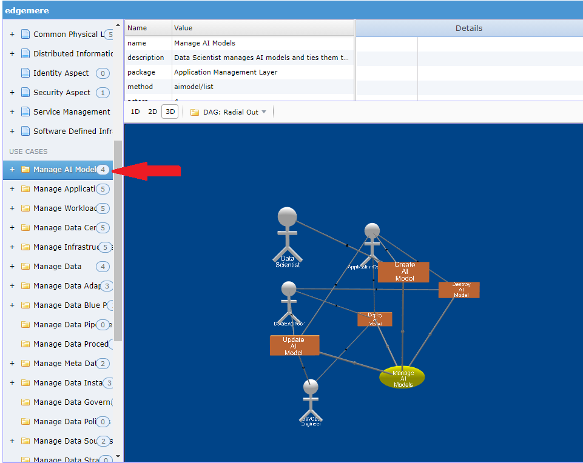

# Web Interface

The web interface provided by the ailtire framework allows for artitects to extend the web interface through a model
view controller pattern. It provides both server generated pages and single page ajax style web pages. By default the
web interface helps the architect simulate the architecture and visualize complex relationships and interactions between
the different subsystems, models, and actions. It presents all UML views of the model in a dynamic model. Including
visualization of object instances, events, scenario and use case execution.

## Library dependencies

Ailtire leverages some javascript libraries to aid in the rapid development of a web interface. The following are the
javascript libraries utilized.

* 3d-force-graph - used to visualize in 3D the static and dynamic architectural elements of the system.
* WebUI - This gives some help functions for laying out the web interface.
* JQuery - Underlying web library used by WebUI, ajax communication, and DOM manipulation.
* Three - 3D object library used to create 3d model elements.

## Web User Interface Layout

The default web interface for an ailtire application look very much like a typical IDE. We tried to follow a paradigm
that would be familiar to most architects.

* Left Panel - Contains the Logical architecture (Packages and Models) and Use Case View(Use Cases and Actors) of the
  system. When an item is selected a 3D graphical representation shows up in the Graphical Viewer.
* Top Panel - Contains detail text of the selected item in any of the other panels.
* Right Panel - Containers the data model. When selected object instances are shown in the Graphical Viewer.
* Graphical Viewer - Shows a 3D view of the currently selected architectural element.
* Bottom Left - Shows a scenario simulator. Ability to launch and manage scenario runs.
* Bottom Right - Shows the events that have fired since the web page has loaded.

Each Architectural Element can be visualized in the Graphical Viewer. Just by selecting on the item the 
Graphical Viewer shows a 3D representation of the element. The elements currently supported are:

* Logical View
  * Model Class - TBD
  * Package
* Use Case View
  * Actor
  * Scenario
  * Use Case
* Process View
  * Event
  * Object Instance
  * Scenario Simulation
  * StateNet
* Deployment View
  * Container Image
  * Micro-segmented Network
  * Micro-service
  * Service Stack

### Model Class
TBD

### Package

To view the structure of a package select the package from the Left Panel. 
The Graphical Viewer and the Top Panels will automatically be populated with details about the package.

Notice that the Top Panel is populated with details from the package design. Additionally the Graphical view
contains a depiction of the package in 3D. Details of the 3D view are below.

The interface to the package is in green and look like a lollipop. The Handlers to the Package are represented in
Magenta with a funnel shape.

The Model Classes of a package are orange cubes and can be found on an adjacent side of the package cube.

The Sub Packages are cubes that are the same color as the package and are the bottom of the Package Cube. 
Turn the cube over to see the sub packages.

 

The Use Cases are a yellow eplisoid on the front of the Package Cube. They typically will interace with
one of the actions on the top of the package cube.

This view of the package gives the ability to see the package's different views and how they interact with each other.

### Actor View

The Use Case View has three major elements: Actor, Use Case and Scenario. 
To select the actor and view its details and a graphical representation of of the actor select the actor in
the left panel. When you do this the top panel details will be filled in with details about the actor.

To drive down any further you can select on items in the detail view to get more information by selecting
additional items. In this example usecases are selected and the detail of the usecases appear on the right.

An actor is represented with a 3D version of the UML actor diagram. In this example the Actor has three use cases,
represented by yellow episoids.

### Use Case View

The Use Case is the primary artifact in the Use Case Model. To select details about a use case select the use
case from the list in the left panel. Use Cases are at the bottom of the list.

Notice that the Use Case details are found in the Top Panel. You can select different elements in the detail
list to get more information.

The Usecase is represented with a yellow elisoid and is conneted to Scenarios and Actors in the system architecture.

### Scenario View

The Scenario shows how a use case is used by a specific actor. Scenarios have steps that are made of actions
that make up how the system operates. When you select a scenario under the use case a couple of things happen.
The graphical View shows the Scenario and its steps and the Bottom Left Panel is populated with the steps
of the scenario.

A Scenario is represented by by a rectangular orange cube and its steps are represented by a longer rectangular 
gray cube. The steps of the scenario are just below the scenario and are sequential order of execution.

You can launch a simulation of a scenario from the Bottom Left Panel's "Launch Button". When the launch button
is pressed each step is run sequentially. The commands represented in the steps are run on the command line in
the base directory of the application.

As the scenario is executed the steps change state. The state of the steps are shown with different colors.

* Blue - Running
* Green - Complete
* Red - Failed
* Gray - Not Run

The state of the steps are shown in the bottom right panel as well as in the graphical view.

### Event View

The event panel is located on the Bottom Right Panel. This shows the number of firing of events in the system.
The different events for a model are shown with colors. Currently the panel is read only.

This panel can be used to watch events happen during simuations of scenarios and the step run during the simulation.

### Object Instance View

Objects are created when scenario simulations are launched. The objects are grouped in the Model Classes. All of the Model
Classes are shown on the Right Panel in the user interface. When you select an Object Model Class, all of the 
object instances of that Model Class are loaded into the Graphical Viewer. Only the first level associations
are loaded into the graphical view.

Each Model Class has its own 3D and 2D visualization. If they are not defined then a sphere is used to
represent the instance. Associations are shown as links in the diagram. See [Model Page](model) for information
about view definition.

When the Model Class is select the Top Left Panel contains a list of object instances. To find out more details
about each object instance select the item in the list. Details about the object instance will appear in the
Top Right Panel. And the Graphical Viewer will highlight the Instance in Yellow and its relationships in
Green (Parent Relationships) and Red (Children Relationships). It will also zoom to where the object 
instance is located in the 3D scene.

### Scenario Simulation View

Simulating Scenarios is easily accomplished by selecting the Scenario in the Left Panel. 
When the scenario is selected the Bottom Left panel is populated with steps for the scenario.
A launch botton appears and the architect can launch the simulation.

The steps have state and color represent the states. The states are shown in the graphical and panel views.

* Blue - Running
* Green - Complete
* Red - Failed
* Gray - Not Run

### StateNet

TBD

## Deployment Model

The application and all of its subsystems, and packages have a deployment strategy. The deployment plan
can be viewed by selecting an environment under the deployment section in the left hand panel.

The key elements in and environment for deployment is the stacks and services deployed in the environment.
A Service is represented as a truncated cone as shown in the diagram above. (Purple). A stack is made of
a collection of services and is represented by a stack of truncated cones. Selecting the environment name will show all of the stacks and services that can be deployed in that enviornment.

### Stack Definition

Stacks are made up of services, data, interfaces, images, and networks. To view a stack definition you can
select the stack name in the left panel. The graphical viewer will show a 3D representation of the stack.
The stack is represented as a cube with each side presenting a different aspect of the stack.

* Right - service and sub-stacks.
* Left - Networks
* Top - Interface
* Back - Container images used
* Bottom - Data and Volumes used

#### Interfaces
The interface to the stack contains information on how to access the stack through a common URL.
Each service in the stack is mapped to a URL path. The base URL of the stack is determined at run
time and can be determined by the controlling application or stack. This allows for lacing of services
that can easily be accessed across multiple layers of complex systems. 

In this example, the base url is http://localhost:3000.
The following URL paths would be valid.
* http://localhost:3000/admin
* http://localhost:3000/aml
* http://localhost:3000/cpl
* http://localhost:3000/diml
* http://localhost:3000/ia
...
  
#### Stacks and Services

Every stack is made up of a set of sub-stacks and/or services. These services are the work horse of the 
stack, and are implemented using containers and micro-services. These services are mapped to at least
one network and can have data volumes and interfaces mapped to them as well. Each service has a 
corresponding image that defines what is run in the service.

Clicking on the service will highlight the other items it is linked to in the stack definition.

#### Image
An image defines what is run in a service when it is executed. These are implemented with standard 
container images. They are shown on the back of the stack definition cube.

#### Network
Every Stack has at least one network. Most have by default two networks Parent and Siblings. 
Ailtire is very opinionated on the network and micro-segmentation based on each stack. If 
a stack contains sub-stacks it will also create a children network and connect all sub-stacks onto
 the children network. This gives separation between the different service layers in the architurce.
The networks are on the left side of the stack definition cube.

#### Data Volume
Stacks not only contain services and networks, they also contain data volumes. This gives the 
ability to connect data sources to the running stacks. Data volumes are shown on tbe bottom of
the stack definition cube.

